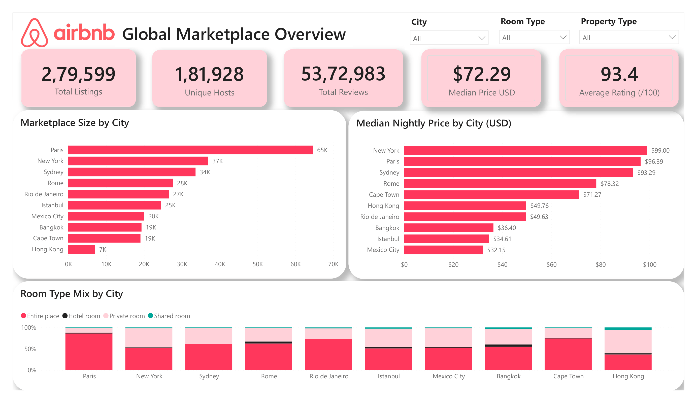
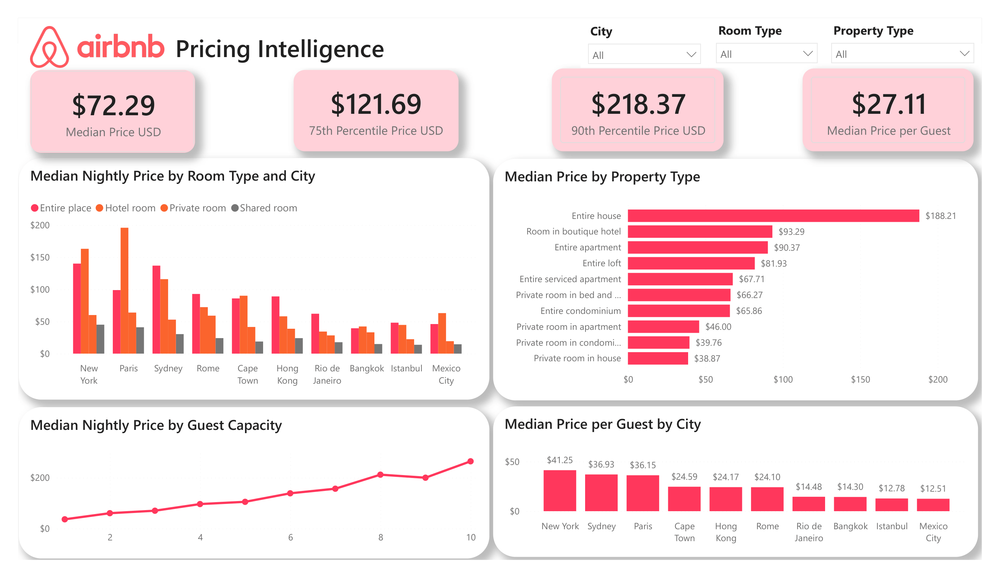
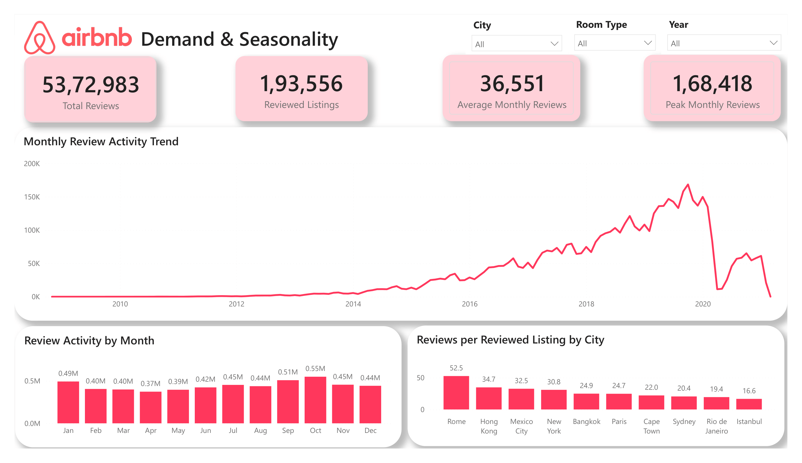
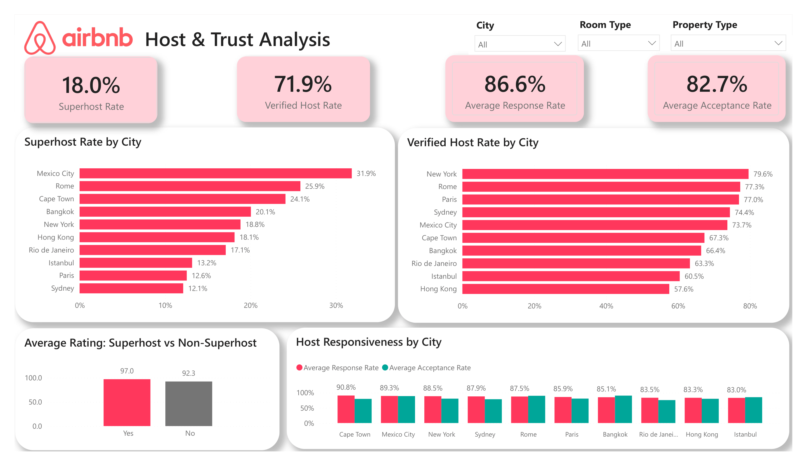
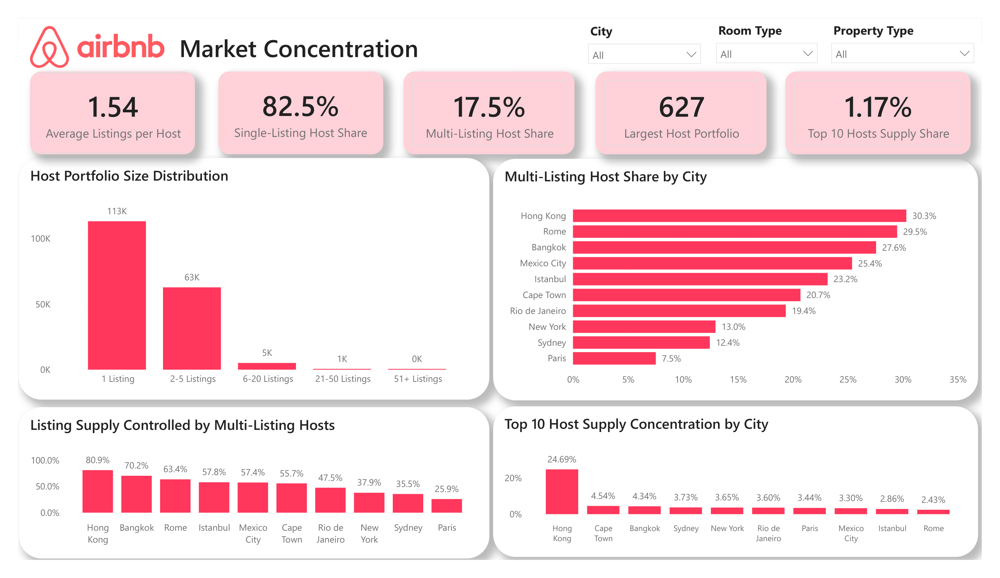

# Airbnb Global Marketplace Analytics

## Project Overview

This project analyzes Airbnb marketplace activity across 10 major global cities using Power BI.

The analysis covers approximately:

- 279,599 cleaned listings
- 5,372,983 unique reviews
- 181,928 unique hosts
- 10 global Airbnb markets

The dashboard explores marketplace size, pricing behavior, guest activity, host trust, and market concentration.

## Tech Stack

- Power BI Desktop
- Power Query
- DAX
- Data Modeling
- CSV data sources
- Git & GitHub

## Skills Demonstrated

- Data cleaning and transformation
- Star-schema data modeling
- DAX measure development
- KPI design
- Pricing and marketplace analytics
- Time-series and seasonality analysis
- Market concentration analysis
- Business insight generation
- Dashboard design and data storytelling

## Dataset

The project uses Airbnb Listings and Reviews data covering 10 global cities.

The raw dataset contains listing-level information such as host attributes, property characteristics, pricing, ratings, and booking policies, along with more than 5 million review records.

Large raw CSV files are excluded from this repository due to file-size constraints. Data dictionaries are included for reference.

## Business Questions

The project was designed to answer five major questions:

1. How does Airbnb marketplace size differ across cities?
2. What factors influence nightly listing prices?
3. How does guest activity and seasonality vary over time and across markets?
4. How do host trust and responsiveness differ between cities?
5. How concentrated is Airbnb inventory among multi-listing and professional hosts?

## Dashboard Pages

### 1. Executive Overview
Provides a high-level view of marketplace size, pricing, ratings, and room-type composition.

### 2. Pricing Intelligence
Analyzes differences in nightly prices across cities, room types, property types, guest capacity, and price per guest.

### 3. Demand & Seasonality
Uses review activity as a proxy for guest activity to analyze long-term trends, monthly seasonality, and normalized review activity across cities.

### 4. Host & Trust Analysis
Examines Superhost penetration, identity verification, host response behavior, booking acceptance, and guest ratings.

### 5. Market Concentration
Measures how Airbnb supply is distributed between single-listing hosts, multi-listing hosts, and the largest host portfolios.

## Key Business Insights

### Marketplace Overview
- Paris is the largest market in the dataset with approximately 65K listings.
- New York has approximately 37K listings, followed by Sydney with approximately 34K.
- Hong Kong is the smallest of the 10 analyzed markets with approximately 7K listings.
- The overall median normalized nightly price is **$72.29**.
- The average listing rating is approximately **93.4/100**.

### Pricing Insights
- New York has the highest typical nightly price among the analyzed cities at approximately **$99**.
- Paris follows at approximately **$96**, while Sydney is approximately **$93**.
- Mexico City is among the most affordable markets with a median price of approximately **$32**.
- Room type and property type have a substantial impact on nightly prices.
- Typical nightly price generally increases as guest capacity increases.
- Price per guest provides a different view of affordability than total nightly price and highlights differences in accommodation value between cities.

### Guest Activity & Seasonality
- More than **5.37 million unique reviews** were analyzed.
- Review activity grew strongly through the late 2010s before showing a sharp decline around 2020.
- Monthly review patterns indicate clear seasonality in Airbnb guest activity.
- After normalizing for marketplace size, Rome shows particularly high review activity per reviewed listing.
- Review counts are treated as an **activity/demand proxy**, not as a direct measurement of bookings.

### Host & Trust Insights
- Approximately **18.0%** of listings are operated by Superhosts.
- Approximately **71.9%** of listings are associated with identity-verified hosts.
- Average host response rate is approximately **86.6%**.
- Average host acceptance rate is approximately **82.7%**.
- Superhost listings have a substantially higher average rating, approximately **97.0/100**, compared with approximately **92.3/100** for non-Superhost listings.
- Mexico City has one of the highest Superhost concentrations among the analyzed markets.

### Market Concentration Insights
- Approximately **82.5%** of hosts operate only one listing.
- Approximately **17.5%** of hosts operate multiple listings.
- The average portfolio contains approximately **1.54 listings per host**.
- The largest host portfolio contains **627 listings**.
- Across the complete marketplace, the top 10 hosts control only approximately **1.17%** of total listing supply.
- However, concentration varies considerably by city.
- Hong Kong stands out as a much more concentrated market, with the top 10 hosts controlling approximately **24.69%** of local supply.

## Data Preparation

The raw data was cleaned and transformed using Power Query.

Key transformations included:

- Correcting column data types
- Standardizing Boolean fields into Yes/No categories
- Handling missing categorical values
- Removing listings with zero price
- Removing listings that accommodated zero guests
- Removing duplicate review IDs
- Flagging extreme minimum-night requirements rather than deleting them
- Creating host portfolio segments
- Creating a dedicated Date dimension
- Normalizing prices into USD for cross-market comparison

## Currency Normalization

The original `price` field represents prices in each market's local currency.

To enable meaningful cross-city comparisons, prices were normalized into USD using a fixed historical exchange-rate reference date.

The original local-currency price was retained to preserve source-data traceability.

## Data Modeling

The Power BI model follows a simplified star-schema structure:

- `Listings` — listing and host-level attributes
- `Reviews` — review-level activity fact table
- `Date` — calendar dimension for time analysis
- `Measures` — centralized DAX measure table

Relationship structure:

`Listings (1) → Reviews (*)`

`Date (1) → Reviews (*)`

## Limitations

- Review activity is used as a proxy for guest demand because actual Airbnb booking and occupancy data is not available.
- Listing prices represent advertised nightly prices rather than completed transaction prices.
- Currency normalization uses a fixed historical exchange-rate reference rather than transaction-date-specific FX rates.
- Some host, district, bedroom, and review-score fields contain missing values.
- A small number of multilingual text fields contain source-level character encoding corruption.
- The dataset ends in 2021 and therefore should not be interpreted as the current Airbnb marketplace.